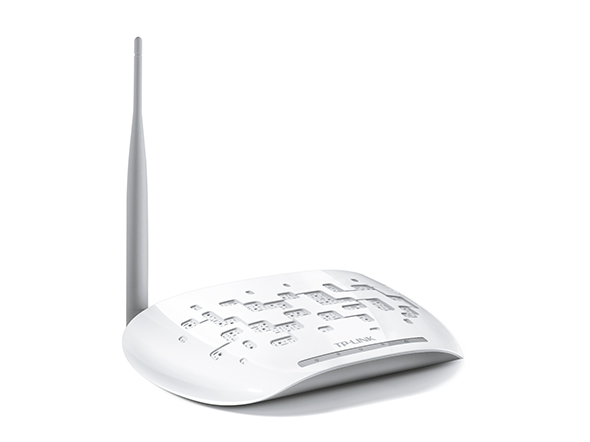

# Welcome to the personal page of Willem Melis (Site is under construction)

Warning this site is still under construction, so things might be wrong/weird.

I am an belgian engineer/ engineering student see [about](about.md) to find out more about me. It's also interesting to check out some of [my finished projects](project.md) that i personally found interesting.

## What am i working on right now?
At the moment i am working on my master thesis to finish my degree of Mathematical engineering. The title of the thesis is: Newton-type operator splitting methods for embedded model predictive control. In this thesis i am implementing an algorithm in c++ to efficiently solve the optimization problem in a Non linear Model predictive controller. 

## Side project
In my sparetime i am playing around with openwrt on the tp-link acces points. I am trying to create a free-wifi acces point that requires an email loggin but without a central server. At this with an acces point with only 4MB of memory.

