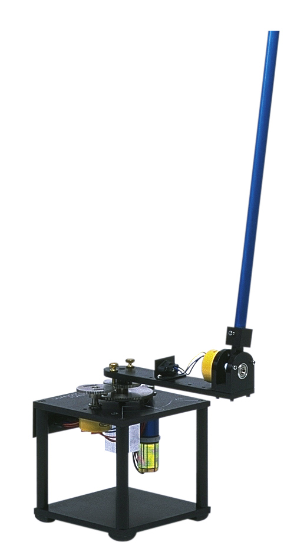
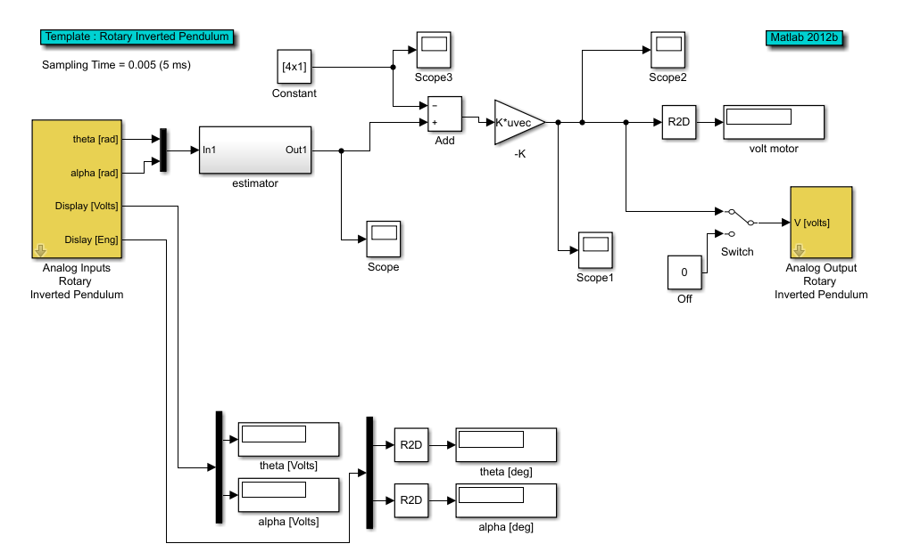
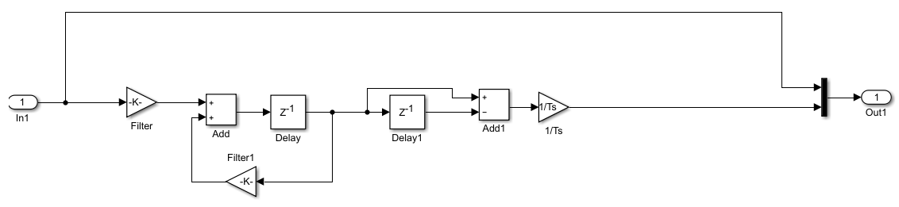

# Project computer aided control system design
This project was realized for the class [Methods and Algorithms for Advanced Process Control](https://onderwijsaanbod.kuleuven.be/syllabi/e/H0M82AE.htm#activetab=doelstellingen_idp1385008).

    

        
    

    Figure1

## The model
The behavior of the rotary inverted pendulum was described in the assignment by a non linear model. This model van be linearized to be expressed as a linear statespace model.
<pre lang="latex">
\begin{cases}
\dot{x}=Ax+Bu \\
y=Cx+Du
\end{cases}
</pre>
The matrices in this case become:
<pre lang="latex">
\begin{bmatrix}
0 & 0 & 1 & 0 \\
0 & 0 & 0 & 1 \\
0 & 40.7 & -12.2 & 0 \\
0 & 38.6 & -4.7 & 0 
\end{bmatrix}
B=
\begin{bmatrix}
0 \\
0 \\
23.3 \\
8.3
\end{bmatrix}
C=
\begin{bmatrix}
1 & 0 & 0 & 0\\
0 & 1 & 0 & 0
\end{bmatrix}
D=
\begin{bmatrix}
0 & 0
\end{bmatrix}" border="0"/>
</pre>
In this case the controller is presumed to be continuous and so the model should be continuos as well. 

## Lab set up
The controller was tested by a physical experiment. An rotary inverted pendulum was connected with simulink which makes testing this controller quiet nice.

    

        
    

    Figure2: simulink diagram

    

        
    

    Figure3: diagram of estimator

View on [Github](https://github.com/Zilleplus/computerGestuurdeRegeltechnieken/tree/master/RIP)