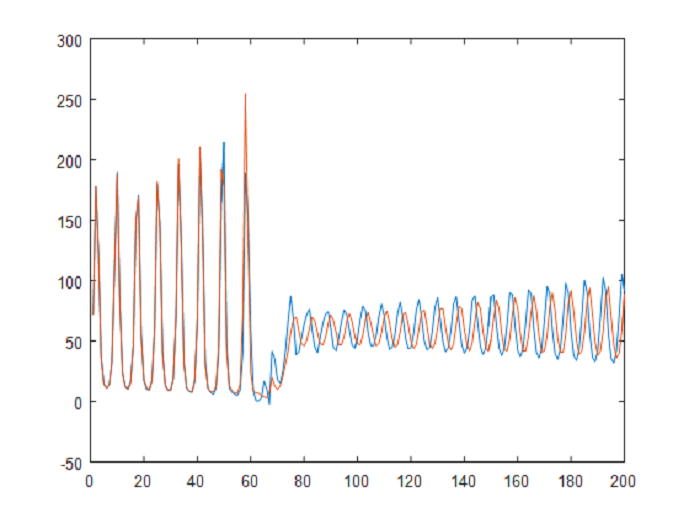
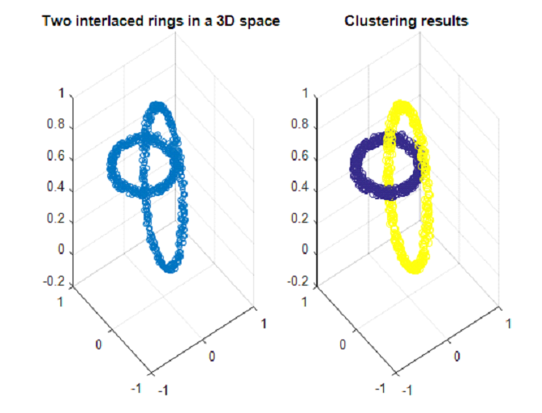

# Project support vector machines

This project was realized for the class [Support Vector Machines: Methods and Applications](https://onderwijsaanbod.kuleuven.be/syllabi/e/H02D3AE.htm#activetab=doelstellingen_idp4531360)

## Regression
One application of least-square support vector machines is regression. A least square support vector machines was used on the Santa Fe Laser dataset to predict values. The image below shows the real data in red and the predicted data in blue.

    

        
    

## Kernel PCA
An othe rvery interesting application of support vector machines is the kernel PCA. Which can find non linear relations that a classic PCA cannot hope to find. The image below illustrates how 2 ellipses where found in a set of 3-dimensional data.

    

        
    

View on [github](https://github.com/Zilleplus/SVM)