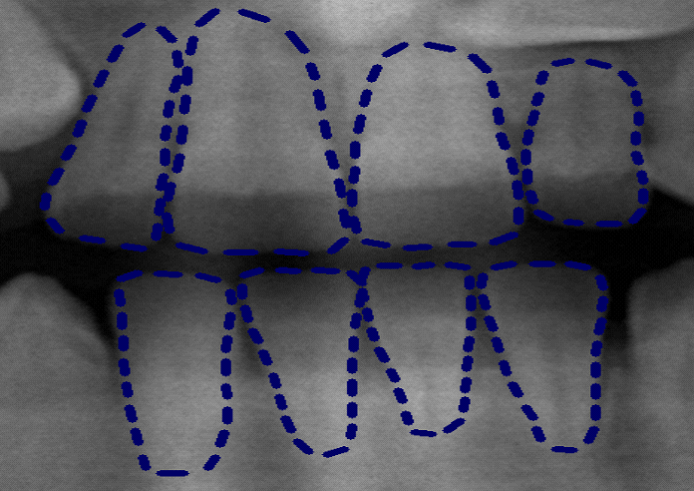
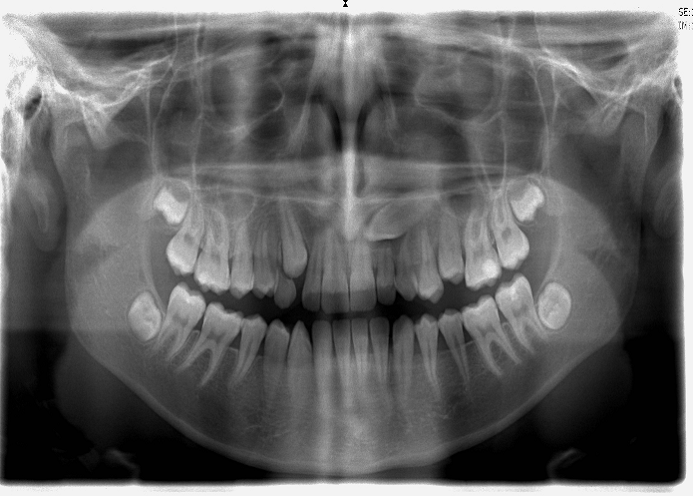
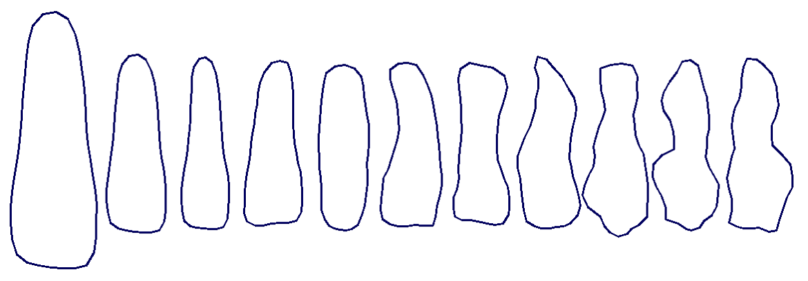
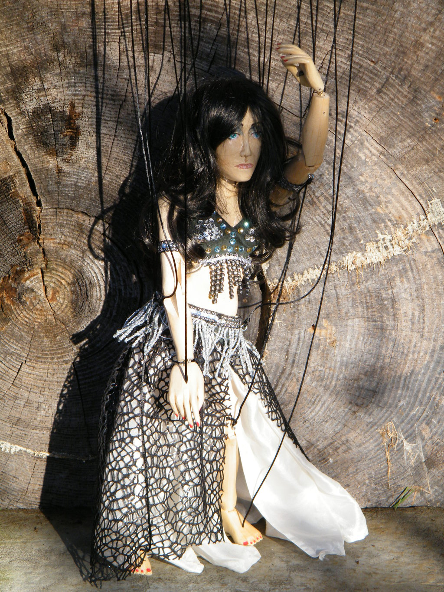
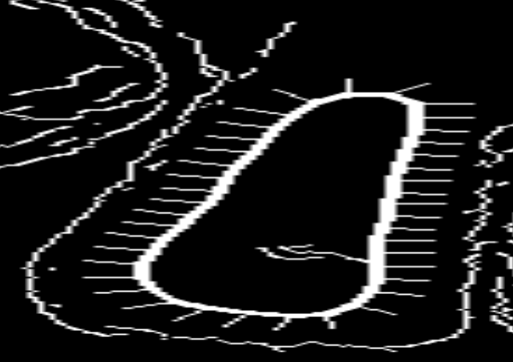
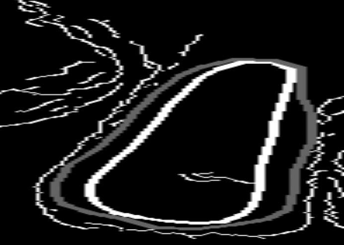
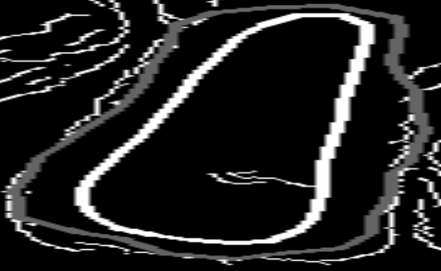
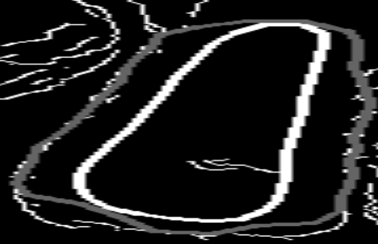

# Project computer vision
This project was realized for the class [Computer vision](https://onderwijsaanbod.kuleuven.be/syllabi/e/H02A5AE.htm#activetab=doelstellingen_idp29371552) related to the Master Mathematical engineering.

## The problem
A bunch of x-ray pictures where given(Figure1 right). Some of these pictures have landmarks that show the borders of the 4 frontal teeth.(see Figure1 left) The question was, how do i determine the borders of the 4 frontal teeth when the landmarks are not given.

    

        
        
    

    Figure1: left Landmarks on teeth, right full picture

## Final algorithm
### Active shape models
One way to solve this problem is by using active shape models. These models use PCA analysis to find principles components of a teeth. These components can then be used to build a new teeth. First 10 principle components are illustrated in Figure2 after the average teeth. The average teeth is obtained by adding together all the principle components each multiplied by there corresponding eigenvalues.

    

        
    

    Figure2: PCA components

For those unfamiliar with linear algebra this all might sound like Greek. Beleave it or not but its not hard at all. After trying to explain it to a few people i came up with the puppet analogy. And some people seem to like it so.

    

        
    

Imagine a puppet , one of those puppets with string attached to it called a marionette. Now take off all the strings. Now you can reattach 1 string, knowing that you have to make it dance with only 1 string. Then attach 2 more strings. 

How will you chose the spots to attach the strings if you know you have to make the puppet dance? You will most likely think about what simple large movements are dominant. And those will influence your first choices. The more strings you can attach the more you will also look at smaller movements. Think about leg movements versus eye movement.

This is PCA analysis, the principle are movements you express with the strings. If you have an infinite amount of strings you could do every movement possible however the puperteer must be a genius then. As there are so many strings to control. This is why a small amount of strings is prefered. We can say that the dimension of the problem is reduced.

### Step direction fitting algorthm
After determining the active shape model we have a very simple way to generate possible shapes of teeth. If we start with the average shape and scale it we get Figure3. The normal of on each of the data points is also printed out. This will be the search direction.

    

        
    

    Figure3: Landmarks on teeth

### Fitting algorthm levels
After reading an interesting paper on these active shape models, it seems a multi level apprach is the best option. Figure4 illustrates the resulting shapes after each level.

    

        
        
        
    

    Figure4: The same white shape in all 3 figures is the starting position of algorthm. The left figure has in grey the shape after level0 fitting, the center level1 fitting and the right level2 fitting

### Final remark
Alltough its not included in the class its possible to use system identification here. The landmarks here allways had the same amount of points. Ths obviously will not allways be the case. The landmarks could be represented by for example an ARMAX model instead of fixed points. This idea is based on a paper i read for the class system identification.

View project on [github](https://github.com/Zilleplus/Project_computer_vision)