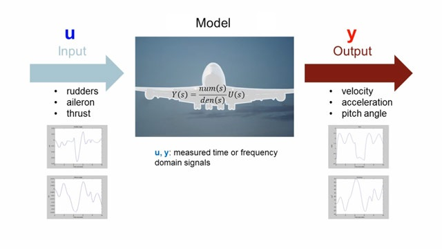

# Project System identification

This project is related to the class of system identication(KuLeuven B. Demoor) and executed in collaboration with Marie Valenduc.

The idea was to determine a model for an unknown filter by using data from the real filter. By sending in a certain input a certain output is obtained. If the input data uses all the dynamics of the model, then the model is implicitly expressed by the data.

Surprisingly enough it is possible to determine the models that are quiet close to the behavior of real filter. Even tough the data is full of noise. 

    

        
    

I found this quiet an elegant way to machine learning. This clearly shows the relationship between system theory and machine learning. 

View on project on
 [Github](https://github.com/Zilleplus/Sys_iden_assignment1)